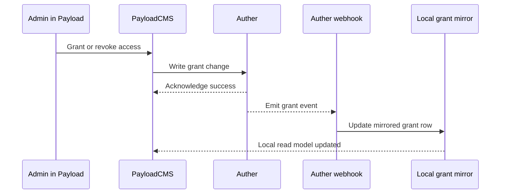

# Authorization Projection Plan

> Draft for review. This note captures the current access shape, why the existing request-time join is not acceptable, and the local projection approach for book grants.

## Problem Statement

We have two different concerns that must not be mixed together:

- Auther owns grant management and permission decisions.
- PayloadCMS owns the book and chapter documents, plus the local user projection.

The current read path in Payload is trying to bridge those two concerns at request time by scanning private books and calling Auther repeatedly. That is not a stable model. It works for small data, but it does not scale, and it puts the hot read path on the wrong side of the boundary.

This document proposes a projection model:

- Auther remains the source of truth for grants.
- Payload stores a local mirror of the grants.
- Reads use only local Payload data.
- Writes are mirrored into Payload through a controlled sync path.

This is not strict CQRS, but it is close enough to reason about the split.

## Current Shape

The current shape is roughly:

- Better Auth token comes into Payload.
- Better Auth strategy maps the token into a local Payload user.
- Book and chapter read helpers inspect the request user.
- If the request is authenticated, the helper currently scans private books in Payload.
- For each candidate book, it calls Auther's check-permission endpoint.
- The result is used to build a local read filter.

Relevant implementation points in this repo:

- [src/lib/betterAuth/strategy.ts](../src/lib/betterAuth/strategy.ts)
- [src/lib/betterAuth/users.ts](../src/lib/betterAuth/users.ts)
- [src/utils/access.ts](../src/utils/access.ts)
- [src/lib/betterAuth/auther.ts](../src/lib/betterAuth/auther.ts)
- [src/app/api/books/[id]/access/route.ts](../src/app/api/books/[id]/access/route.ts)
- [src/components/admin/books/BookAccessPanel.tsx](../src/components/admin/books/BookAccessPanel.tsx)

### Current Read Flow

1. Blog forwards the viewer token to Payload.
2. Payload authenticates the user.
3. `publicBooksReadAccess` or `chaptersReadAccess` runs.
4. The helper queries private books from Payload.
5. It checks Auther one book at a time.
6. It builds a read filter from the allowed ids.

That is the problem. The read path is doing a remote permission join on every request.

### Current Write Flow

1. Admin opens the book editor in Payload.
2. `BookAccessPanel` lists grants and lets the admin add or revoke access.
3. Payload proxy route calls Auther internal grant endpoints.
4. Auther is the only grant source of truth.

This means the write path is already centralized in Auther, but the read path is not.

## Why The Current Shape Is A Problem

The main issue is the hot path.

A book list or chapter list can trigger a lot of grant checks. If there are 10k private books, the request can become 10k candidate checks in the worst case. That is too much for a normal page load.

Other problems:

- The read path depends on an external service being fast and healthy.
- There is no clean transaction boundary between Auther and Payload.
- The blog would still be forced to forward identity, but the read model would be expensive.
- The logic is hard to reason about because the read decision is split across two systems.

## Proposed Shape

The cleaner shape is a local grant projection in Payload.

### High Level

- Auther continues to own grant creation, revocation, and policy decisions.
- Payload stores a local mirror of the grants.
- Payload read access checks the mirror only.
- The blog forwards the token, but does not perform grant logic.

### Mental Model

Think of it as:

- Auther = command source and grant authority.
- Payload = read model for books, chapters, users, and mirrored grants.

This is closer to event projection than to a runtime join.

## Proposed Data Model

A local collection or table in Payload should represent the mirrored grants.

Suggested fields:

- `autherTupleId`
- `principalType` for example `user`
- `principalId` for the Payload user id or Better Auth linked id
- `bookId`
- `relation` for example `reader`, `editor`, `owner`
- `sourceUpdatedAt`
- `syncStatus` if you want reconciliation visibility

Important constraints:

- Use stable ids only.
- Do not key the mirror off email.
- Use an idempotency key from Auther, ideally the tuple id.
- Index `principalId` and `bookId` heavily, because that is the read path.

### User Projection

We already have a local Payload user projection through Better Auth token sync.

That means the mirror should join to the local user record, not to a raw token string.

## Proposed Write Flow

The safest write flow is one controlled write source and one projection update.

### Recommended Order

1. Admin submits grant or revoke in Payload.
2. Payload proxy route calls Auther.
3. Auther writes the grant or revoke.
4. Auther emits a webhook or event.
5. Payload consumes the event and updates the local mirror.

### Why This Order

- Auther remains authoritative.
- Payload mirror is updated from the event stream.
- If the mirror update fails, a retry or reconciliation job can fix it.
- The UI does not need to dual write directly to two systems in the same request.

### What Not To Do

Do not let the UI write the grant in Auther and Payload independently as two equal side effects.

That produces split-brain when one write succeeds and the other fails.

## Proposed Read Flow

Reads should only use Payload.

### Books

- Anonymous users get public and published books only.
- Authenticated users get public books plus books where the local mirror says they have access.
- Admins bypass the rule.

### Chapters

- Chapters inherit book access.
- If the user can read the book, they can read the chapter.
- Chapter access should not require a second external grant lookup.

### Blog Behavior

The blog should:

- Forward the token.
- Not run a permission decision itself.
- Render based on Payload responses.

## Suggested Event Flow

A useful way to think about it is a simple event projection.

## Edge Cases

### 1. Dual write failure

If the Auther write succeeds but the mirror write fails, the systems diverge.

Mitigation:

- Treat Auther as the source of truth.
- Make the mirror retryable.
- Provide a reconciliation job.

### 2. Webhook loss

If Auther emits an event but Payload misses it, the mirror becomes stale.

Mitigation:

- Reconcile periodically.
- Make the mirror replayable from Auther state.

### 3. Out of order delivery

A revoke may arrive before the corresponding grant create, or an older event may arrive late.

Mitigation:

- Use Auther tuple id as idempotency key.
- Store source timestamps or versions.
- Ignore stale updates.

### 4. Duplicate events

Auther webhook delivery may retry.

Mitigation:

- Upsert by tuple id.
- Make create and revoke idempotent.

### 5. User exists in Auther but not in Payload

The local grant row may reference a user that has not been projected yet.

Mitigation:

- Backfill the user projection.
- Accept delayed access until the user row exists.

### 6. User email changes

Do not key the mirror off email.

Mitigation:

- Join on stable user id or Better Auth subject id.
- Treat email as display data only.

### 7. Book ownership transfer

If a book changes owner, existing access rows may need re-evaluation.

Mitigation:

- Rebuild grants for that book.
- Clear or revalidate dependent rows.

### 8. Book deletion

If a book is deleted, mirror rows can become orphaned.

Mitigation:

- Cascade delete the mirror rows.
- Or mark them stale and clean them in reconciliation.

### 9. Grant revoked but cache still says yes

A read cache can temporarily allow access after revoke.

Mitigation:

- Keep cache TTL short.
- Prefer fail-closed for missing or stale mirror rows.

### 10. Large grant volume

If a user has many grants, the mirror query must still stay fast.

Mitigation:

- Index by `principalId` and `bookId`.
- Keep read queries local and narrow.

### 11. Chapter inheritance edge

A private book grant must imply chapter access.

Mitigation:

- Derive chapter access from book grant.
- Avoid a separate chapter grant path unless there is a genuine chapter exception.

### 12. Partial reconciliation

A repair job may only sync half the missing rows.

Mitigation:

- Make reconciliation resumable.
- Track last successful sync point.

### 13. Missing mirror row

If the mirror is missing, do not guess open.

Mitigation:

- Deny private access until the mirror proves access.

## Operational Requirements

A local projection only works if we accept some operational discipline.

- Grant writes must be idempotent.
- Webhooks must be retryable.
- Mirror updates must be replayable.
- A periodic reconciliation job should compare Auther state with Payload state.
- The read helper should never depend on the blog doing any filtering itself.

## What Still Lives Where

### Auther

Auther owns:

- Grant create and revoke
- Permission checks
- Webhook emission
- Source of truth for access policy

### Payload

Payload owns:

- Books and chapters data
- Local user projection
- Grant mirror
- Read access helpers
- Admin UI for grants

### Blog

The blog owns:

- Token forwarding
- Presentation
- Locked state UI
- No permission decisions

## Recommended Decision

Use the local projection.

Do not keep the request-time remote join.
Do not let the blog make the access decision.
Do not dual write grant state from the UI as two equal writes.

The clean split is:

- Auther decides grants.
- Payload mirrors grants.
- Payload answers reads.
- Blog forwards the token.

## Open Questions

Before implementation, the team should agree on these:

- Is the local mirror keyed by Payload user id or Better Auth subject id?
- Will Auther emit webhooks for grant create and revoke, or do we add a polling reconciler too?
- Do we need separate principals for groups and users?
- Can a grant be edited outside the Payload admin UI?
- Should missing mirror rows deny access immediately, or should there be a short retry window?

## Summary

The CQRS-like shape is valid here only if Payload is the read projection and Auther is the write authority.

The dangerous part is not the pattern itself. The dangerous part is trying to do a live join on every read request.

The fix is to move to a local mirrored grant table and keep the hot path entirely inside Payload.