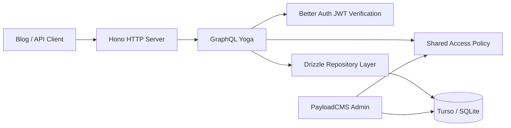

# Hono + GraphQL Yoga Dynamic GraphQL TDD

> Status: Draft
>
> Scope: read-only GraphQL server for the CMS side. PayloadCMS remains the main portal for admin and writes. Hono is the HTTP boundary, GraphQL Yoga is the GraphQL execution engine, and a shared schema/repository/policy layer is the actual source of truth.

---

## 1. Decision Summary

This design is feasible now, but only if the boundary is strict:

- Hono owns transport, routing, middleware, and deployment shape.
- GraphQL Yoga owns GraphQL execution, GraphiQL, plugins, and request context.
- Drizzle schema plus a curated exposure registry own the data contract.
- Better Auth token verification is reused directly.
- Payload AuthStrategy wrappers are not reused directly.
- Payload collection configs remain Payload-specific and should not become the GraphQL source of truth.
- The first release is read-only.
- PayloadCMS remains the admin/write surface.

The main idea is not "reuse Payload GraphQL". The idea is:

1. Extract the stable, transport-neutral parts.
2. Generate the GraphQL schema from a registry instead of writing one resolver file per query.
3. Keep Payload as the CMS portal while Hono exposes the read API.

---

## 2. What I Checked In This Repo

The current repo state makes the split very clear.

| File                                                                                            | What it shows                                               | Implication                                                    |
| ----------------------------------------------------------------------------------------------- | ----------------------------------------------------------- | -------------------------------------------------------------- |
| [src/app/(payload)/api/graphql/route.ts](../src/app/%28payload%29/api/graphql/route.ts)         | Payload generates the GraphQL route                         | Hono/Yoga should be a separate server boundary                 |
| [src/graphql/index.ts](../src/graphql/index.ts)                                                 | Payload custom GraphQL entrypoint                           | This layer is Payload-specific, not a generic GraphQL engine   |
| [src/graphql/queries/SimilarPosts/index.ts](../src/graphql/queries/SimilarPosts/index.ts)       | Query type is built from `payload.collections[...]`         | Not reusable as-is outside Payload                             |
| [src/graphql/queries/SimilarPosts/resolver.ts](../src/graphql/queries/SimilarPosts/resolver.ts) | Resolver uses `context.req.payload` and Payload `find` APIs | Must be rewritten into repository calls                        |
| [src/utils/access.ts](../src/utils/access.ts)                                                   | Access rules are mixed with Payload request and hook logic  | Policy logic can be extracted, wrappers cannot                 |
| [src/utils/access-shared.ts](../src/utils/access-shared.ts)                                     | Small pure helper surface already exists                    | Good seed for a transport-neutral policy layer                 |
| [src/lib/betterAuth/tokens.ts](../src/lib/betterAuth/tokens.ts)                                 | JWT verification is separate from Payload                   | This can be reused in Hono middleware                          |
| [src/lib/betterAuth/strategy.ts](../src/lib/betterAuth/strategy.ts)                             | Payload AuthStrategy wrapper around token verification      | Useful as a pattern, not directly reusable in Hono             |
| [src/lib/turso.ts](../src/lib/turso.ts)                                                         | Turso connection resolution is already isolated             | Good place to anchor the DB adapter                            |
| `shared/db/generated/schema.ts`                                                                 | Generated DB schema snapshot                                | Good bootstrap artifact, but not the long-term public contract |
| `shared/db/generated/relations.ts`                                                              | Generated Drizzle relations snapshot                        | Same bootstrap role as the schema snapshot                     |

The important observation: the repo already has the pieces needed for a split architecture, but they are in Payload-shaped wrappers today.

---

## 3. Feasibility Verdict

Yes, this is feasible.

What makes it feasible:

- The DB schema can be derived from migrations or from a generated Drizzle schema.
- Hono is built around Web Standards, so it can sit on a clean HTTP boundary.
- GraphQL Yoga accepts a `GraphQLSchema` plus a request context, and it is designed to be extended with plugins.
- Better Auth token verification is already isolated in a reusable helper.

What would make it infeasible:

- Trying to import `src/collections/*` as if they were an ORM.
- Trying to reuse `PayloadRequest` or `req.payload` inside Hono resolvers.
- Building the GraphQL schema from scratch on every request.
- Exposing every raw DB table directly, including internal version and relation tables.

The right design is a controlled rewrite of the transport and schema-exposure layers, not a copy-paste of Payload config.

---

## 4. Architecture

### 4.1 High-Level Shape



### 4.2 Layer Responsibilities

- Hono
  - route registration
  - CORS
  - error handling
  - auth middleware
  - request logging
  - GraphQL endpoint mounting

- GraphQL Yoga
  - schema execution
  - GraphiQL in development
  - introspection control
  - plugins
  - request context assembly
  - execution cancellation

- Schema registry
  - decides which collections/tables are exposed
  - decides field names and relation exposure
  - decides default query shapes
  - decides whether a query is generated or custom

- Repository layer
  - one place for SQL/Drizzle queries
  - pagination
  - filtering
  - relation loading
  - transaction boundaries

- Shared policy layer
  - public vs authenticated vs owner vs admin vs grant-based read scope
  - field visibility decisions
  - reusable enough to support both Hono and Payload adapters

### 4.3 Key Inference

This is an architecture inference, not a framework-specific recipe:

- Hono uses Web Standards and `fetch`-style request/response objects.
- Yoga is built around request context and can operate with a generic schema object.

That means the Hono -> Yoga boundary should be a thin adapter, not a large translation layer.

---

## 5. Canonical Data Contract

### 5.1 The DB Schema Is the Base, Not Payload Config

The Payload collection files are not the schema source of truth.

The actual runtime contract is:

- tables and indexes in migrations
- the generated Drizzle schema
- the relational graph in the generated relations file

The current introspection snapshot in `shared/db/generated/` is useful as a bootstrap artifact, but the long-term contract should live in committed source, not in `tmp/`.

### 5.2 Recommended Source-of-Truth Split

Use two layers:

1. DB schema layer
   - derived from migrations / Drizzle
   - contains tables, columns, indexes, and relations

2. GraphQL exposure registry
   - a smaller curated manifest that says what is public
   - decides query names, field names, relation depth, and access policy

This avoids the worst trap: exposing the entire database as GraphQL just because a schema exists.

### 5.3 What Should Stay Internal

Do not expose these by default:

- `_v` version tables
- `_rels` tables
- `payload_*` system tables
- grant projection internals unless there is a specific internal/admin need

The public GraphQL API should expose content and read models, not the CMS's storage mechanics.

### 5.4 What Should Be Exposed First

Likely first-pass entities:

- `books`
- `chapters`
- `posts`
- `categories`
- `media`
- `users` for self/profile reads

Maybe later:

- `homepage`
- `grant_mirror`
- `deferred_grants`

The last two should probably remain internal unless a clear product need appears.

---

## 6. Dynamic GraphQL Strategy

The user requirement is "I do not want to define every single query."

The right answer is not "one huge hand-written schema file".
The right answer is "a registry that auto-generates the common query surface."

### 6.1 Generated Query Shape

Each exposed entity should generate, by default:

- a single-item query
- a list query
- a filter input
- a sort input
- a pagination input
- relation fields for exposed relations

That means the bulk of the API does not need handwritten query modules.

### 6.2 Registry-Driven Generation

Suggested entity descriptor shape:

```ts
type EntityDescriptor = {
  name: 'Book'
  table: 'books'
  rootQuery: 'book'
  listQuery: 'books'
  primaryKey: 'id' | 'slug'
  defaultOrderBy: 'updatedAt'
  expose: {
    item: true
    list: true
    relations: true
  }
  fields: {
    title: { type: 'String'; filterable: true; sortable: true }
    visibility: { type: 'Enum'; filterable: true }
  }
  relations: {
    chapters: { kind: 'many'; target: 'Chapter' }
  }
  access: {
    read: 'public-or-owner-or-granted'
  }
}
```

The GraphQL schema builder should iterate the registry and produce:

- GraphQL object types
- root query fields
- input types
- relation resolvers
- default list/item resolvers

### 6.3 Manual Queries Become Exceptions

Custom queries should still exist, but only for special cases.

Examples:

- `similarPosts`
- `searchBooks`
- `readingProgress`

These should be registry entries with a custom resolver, not a separate file per query unless they truly need custom behavior.

### 6.4 Schema Building Approach

Use programmatic schema generation, not per-request schema reconstruction.

Yoga supports supplying a schema and also supports schema factory patterns, but its docs explicitly warn against rebuilding a schema from scratch for every request. The schema should be prebuilt at server start and cached.

That makes the boot sequence:

1. load DB schema metadata
2. load exposure registry
3. build GraphQL schema once
4. create Yoga once
5. serve requests

### 6.5 Filtering and Pagination

Start simple, then harden.

Recommended v1 behavior:

- `page` + `limit` + `sort`
- deterministic default ordering
- field-level filters for the common cases

Recommended v2 behavior for hot collections:

- cursor pagination
- connection types
- batched relation hydration

Do not overbuild connections before the read paths are known.

### 6.6 Relation Hydration

Relation fields should be resolved from the repository layer, not by recursive ad hoc DB reads in the resolver.

Use per-request batching so a GraphQL query like:

- `book -> chapters -> author`

does not become an N+1 query storm.

Use a loader keyed by:

- table name
- primary key
- relation target

### 6.7 Internal vs Public Type Naming

Do not leak raw table names into the public GraphQL contract unless it is intentional.

Prefer:

- `Book`
- `Chapter`
- `Post`
- `Category`

Over:

- `books`
- `chapters`
- `posts`

The root query names can stay plural, but object types should read like API types, not tables.

---

## 7. Authentication Strategy

### 7.1 Reuse the Token Verifier, Not the Payload Strategy

The reusable part is [src/lib/betterAuth/tokens.ts](../src/lib/betterAuth/tokens.ts), especially `verifyBetterAuthToken()`.

The Payload-specific wrapper in [src/lib/betterAuth/strategy.ts](../src/lib/betterAuth/strategy.ts) depends on the Payload auth contract and should not be imported by Hono directly.

### 7.2 Hono Auth Middleware

The Hono middleware should:

1. extract a token from `Authorization: Bearer ...`
2. fall back to a supported cookie if the deployment wants cookie auth
3. verify the JWT with the Better Auth JWKS
4. resolve the local user projection if needed
5. attach `auth`, `user`, and `roles` to request context

### 7.3 Anonymous vs Invalid Token

Use this rule:

- no token present -> anonymous request
- token present but invalid -> reject with 401

That keeps public browsing simple while still failing closed when a client sends a bad credential.

### 7.4 Context Shape

The GraphQL context should carry:

- `request`
- `headers`
- `auth`
- `user`
- `db`
- `loaders`
- `policy`

Resolvers should not read from globals or the raw Node request directly.

### 7.5 Role Model

The existing role model is simple:

- `admin`
- `user`

That is enough for the first version.

Admin bypass should still exist for internal use, but it should be explicit in policy code, not implicit in transport code.

---

## 8. Access and Policy Layer

This is the piece that needs the most care.

### 8.1 What Should Be Shared

Share the policy logic, not the Payload access wrapper.

Good candidates:

- public read vs authenticated read
- owner checks
- admin checks
- grant-based checks
- visibility rules for published content
- field-level read visibility

Bad candidates:

- anything that directly returns a Payload `Access` object
- anything that depends on `req.payload`
- anything that mutates docs in hooks

### 8.2 Proposed Policy Shape

Use a neutral policy object, for example:

```ts
type ReadScope =
  | { kind: 'public' }
  | { kind: 'owner'; userId: string }
  | { kind: 'granted'; userId: string; bookIds: string[] }
  | { kind: 'admin' }
```

Then adapt it:

- Payload adapter -> Payload `Access` clause
- Hono adapter -> SQL `WHERE` clause

### 8.3 Book and Chapter Rules

The current repo already models the important read rules:

- public content is published and visible
- authenticated users can see content they own
- some content is grant-based
- chapters inherit book visibility

Those same rules should be the policy source, not duplicate logic in two servers.

### 8.4 Grant Mirror and Live Checks

If the read API needs to honor private books, it should use the same grant mirror / projection strategy that the CMS side uses.

That means:

- unconditional grants can stay local
- conditional grants can use a live check path if needed
- admin can bypass the grant check

If the first Hono version is read-only and performance-sensitive, prefer a local projection over request-time remote permission checks.

### 8.5 Payload Compatibility

If Payload stays the main portal, the shared policy layer should remain compatible with it.

That means the policy layer should be designed so:

- Hono can translate it into SQL
- Payload can translate it into access clauses

The policy logic should not care which transport asked the question.

---

## 9. Repository and Data Layer

### 9.1 Repository Interfaces

The repository layer should expose a small set of operations:

- `findById`
- `findBySlug`
- `list`
- `count`
- `findRelated`
- `search`

Every GraphQL resolver should use these operations instead of embedding SQL in resolver code.

### 9.2 Why This Matters

If resolvers do raw SQL directly:

- policy logic gets duplicated
- batching gets harder
- caching gets inconsistent
- tests get brittle

The repository should be the only layer that knows about table names and joins.

### 9.3 Drizzle as the Query Builder

Drizzle is the right place for the Hono-side ORM/repository layer because:

- the repo already uses SQLite / Turso
- the schema is already represented in Drizzle form via introspection
- the schema is typeable and composable

The repository layer should be generated or derived from committed schema files, not from the Payload collection files.

### 9.4 Relationship to the Current Generator Script

The current introspection script is a bootstrap tool.

Use it to:

- apply migrations to SQLite
- regenerate the schema snapshot
- regenerate relations
- format the output
- lint/typecheck the generated files

But do not treat the temp output as the long-term API contract.

The runtime contract should be committed source, not a one-off temp dump.

---

## 10. Hono Integration

### 10.1 Why Hono Fits

Hono uses Web Standards and runs on Node.js, Bun, Deno, Workers, Lambda, and other fetch-compatible runtimes.

For this project, that means:

- the server boundary is small
- request/response handling stays simple
- the same design can run in Node first and move later if needed

### 10.2 Server Shape

Suggested transport shape:

- `app` for the Hono instance
- `graphql` route mounted on the app
- shared middleware before the GraphQL handler
- explicit not-found and error handlers

### 10.3 Middleware Order

Recommended order:

1. request ID
2. logging
3. CORS
4. auth extraction
5. auth verification
6. request context injection
7. GraphQL Yoga handler

### 10.4 GraphiQL

GraphiQL should be enabled in development and disabled in production unless there is a strong reason to expose it.

### 10.5 Introspection

Use introspection as a development tool, not a permanent public feature.

Yoga has an introspection control plugin and supports disabling introspection based on request or context.

Recommended policy:

- dev -> introspection on
- prod -> introspection off by default
- internal authenticated routes -> allow only if explicitly needed

### 10.6 Execution Cancellation

Use Yoga's execution-cancellation support so abandoned requests do not keep chewing through the DB.

That matters more once list queries and relation hydration exist.

### 10.7 Caching

Caching should be added only after the initial query plan is stable.

Good first caching targets:

- public book list
- public post list
- homepage-style queries

Avoid caching personal/private results until the auth and invalidation story is explicit.

---

## 11. Response Design

### 11.1 Public Queries

Public queries should return only published, visible content.

### 11.2 Authenticated Queries

Authenticated queries can expand to include:

- owned content
- grant-backed private content
- profile data for the current user

### 11.3 Internal Queries

Internal or admin-only queries should be separated from public queries.

Do not make admin-only access accidental just because the schema exists.

### 11.4 Draft and Versioned Content

This is an explicit product decision, not an implementation accident.

Options:

- exclude drafts entirely from Hono
- expose drafts only to admin tokens
- expose preview queries behind a separate scope

The safe default is to exclude drafts until a preview story exists.

---

## 12. Migration Plan

### Phase 0: Schema and Repo Foundation

Goals:

- promote the generated schema from bootstrap artifact to committed source
- define the exposure registry
- define repository interfaces
- define neutral policy objects

Acceptance:

- schema files format cleanly
- lint and typecheck pass
- no GraphQL route change yet

### Phase 1: One Entity End to End

Pick one low-risk entity first, likely `books`.

Goals:

- Hono serves one GraphQL query pair:
  - `book`
  - `books`
- auth context works
- policy translation works
- repository layer works

Acceptance:

- one entity query is live
- anonymous/public access matches the current CMS behavior
- auth access does not regress

### Phase 2: Chapter Inheritance and Relation Hydration

Goals:

- `chapters` can be resolved through book access
- relation loading is batched
- N+1 is controlled

Acceptance:

- chapter visibility matches book visibility
- the query plan does not explode under simple nested selection

### Phase 3: Content Expansion

Add the rest of the user-facing read models:

- posts
- categories
- media
- users/profile reads

Acceptance:

- schema is still generated from registry
- public contract stays stable

### Phase 4: Consumer Verification

Because the consumer repo is separate, verify the public GraphQL contract before turning traffic over.

Recommended:

- contract tests
- schema snapshot diff
- a staged switch for the blog consumer

If the consumer is not explicit in code search, preserve the current endpoint semantics until the new one is proven equivalent.

### Phase 5: Optional Mutations

Do not start here.

Only after the read API is stable should you consider mutations, and even then they should reuse the same policy/repository layer.

---

## 13. Testing Plan

This should be test-driven in the literal sense.

### 13.1 Schema Snapshot Tests

Test that:

- the generated GraphQL schema is stable
- the public schema does not accidentally expose internal tables
- field names stay predictable

Recommended checks:

- `printSchema()` snapshot
- introspection snapshot in dev
- no internal table names in public types

### 13.2 Repository Tests

Test the repository in isolation against SQLite.

Cases:

- find by id
- find by slug
- list with pagination
- list with sort
- relation hydration
- filtering by visibility and ownership

### 13.3 Auth Tests

Test token handling separately.

Cases:

- no token -> anonymous
- valid Better Auth JWT -> authenticated context
- expired token -> rejected
- malformed token -> rejected
- cookie token and bearer token both work if supported

### 13.4 Policy Tests

The policy layer should have the most explicit tests.

Cases:

- public content is visible anonymously
- owner can see own content
- admin bypasses read restrictions
- grant-backed private content is visible
- chapters inherit book access
- internal tables are blocked by default

### 13.5 Resolver Tests

Resolver tests should verify behavior, not implementation details.

Cases:

- `book(id)` returns the expected record
- `books` returns the correct set and order
- nested relations resolve without duplicated DB hits
- custom computed queries work, but are rare

### 13.6 Hono Integration Tests

Use request-level tests against the Hono app.

Cases:

- GET `/graphql` shows GraphiQL only in dev
- POST `/graphql` executes a public query
- invalid auth gets rejected
- authenticated query receives the right context
- introspection policy behaves as expected

### 13.7 Contract Tests for the Consumer

The blog consumer is a separate surface, so add contract tests before cutover.

The goal is to prove the new GraphQL API is backward-compatible where it needs to be, not to guess.

---

## 14. Acceptance Criteria

The design is successful when all of the following are true:

- Hono can serve GraphQL without Payload being in the request path.
- Yoga can execute queries against a dynamically built schema.
- The schema is generated from a registry, not hand-written per query.
- The schema builder does not expose internal tables by default.
- Better Auth JWTs are verified in Hono.
- The same read policy can be adapted to Payload and Hono.
- Read-only public and authenticated content behave as expected.
- Generated schema files are formatted and lintable.
- The CMS remains the main portal.

---

## 15. Risks and Open Questions

### 15.1 How Much Draft Content Should Be Exposed?

This needs an explicit product decision.

### 15.2 Should the Public GraphQL API Be Introspection Friendly?

Probably no in production, yes in development.

### 15.3 Should the Hono Server Be a Separate Process or a Next.js Route?

Both are possible.

The cleanest first step is usually a separate Hono process or entrypoint so the boundary is obvious.

### 15.4 What Is the Long-Term Schema Source?

The temp introspection output is useful, but the committed source should be the canonical schema artifact.

### 15.5 How Do We Keep the Blog Contract Stable?

Because the consumer repo is separate, the safest rollout is:

- preserve endpoint semantics
- add contract tests
- cut over gradually

### 15.6 What About Mutation Hooks?

Leave them for later.

Hooks are the hardest part to reuse because they are the most Payload-shaped. For a read-only Hono server, most hooks should remain Payload-only.

---

## 16. Recommended File Boundaries

These are the boundaries I would use if the design moves to implementation.

- Keep in `src/lib/`
  - Turso adapter
  - Better Auth token utilities
  - any external-service wrapper

- Keep in `src/utils/`
  - pure access policy helpers
  - schema registry helpers
  - ID normalization
  - query-shape helpers

- Keep in `src/collections/`
  - thin Payload collection config only
  - access and hook wrappers only

- Put the Hono server in a new boundary
  - do not overload `src/graphql/`
  - keep Payload custom GraphQL extensions separate from the new Yoga server

That last point matters: the current `src/graphql/` folder is Payload GraphQL extension code, not the new server.

---

## 17. References

Official docs used to shape this plan:

- Hono web standards: https://hono.dev/docs/concepts/web-standard
- Hono app API: https://hono.dev/docs/api/hono
- GraphQL Yoga context: https://the-guild.dev/graphql/yoga-server/docs/features/context
- GraphQL Yoga plugins: https://the-guild.dev/graphql/yoga-server/docs/features/envelop-plugins
- GraphQL Yoga introspection: https://the-guild.dev/graphql/yoga-server/docs/features/introspection
- GraphQL Yoga schema docs: https://the-guild.dev/graphql/yoga-server/v4/features/schema

Current repo anchors:

- [src/app/(payload)/api/graphql/route.ts](../src/app/%28payload%29/api/graphql/route.ts)
- [src/graphql/index.ts](../src/graphql/index.ts)
- [src/graphql/queries/SimilarPosts/index.ts](../src/graphql/queries/SimilarPosts/index.ts)
- [src/graphql/queries/SimilarPosts/resolver.ts](../src/graphql/queries/SimilarPosts/resolver.ts)
- [src/utils/access.ts](../src/utils/access.ts)
- [src/utils/access-shared.ts](../src/utils/access-shared.ts)
- [src/lib/betterAuth/tokens.ts](../src/lib/betterAuth/tokens.ts)
- [src/lib/betterAuth/strategy.ts](../src/lib/betterAuth/strategy.ts)
- [src/lib/turso.ts](../src/lib/turso.ts)
